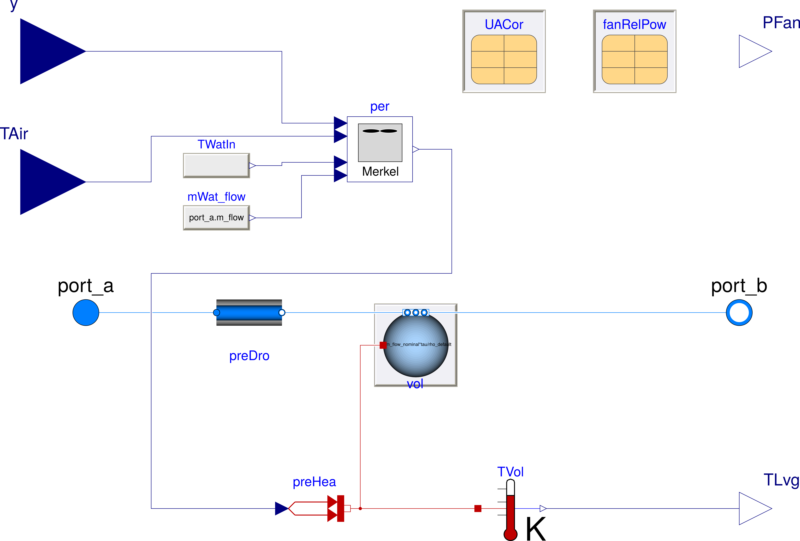

.. _Development:

Development
===========

This section describes the development of the `Buildings` library.

Contributing
------------
Contributions of new models and suggestions for how to improve the library are
welcome.
Models that are contributed need to adhere to the following guidelines, as this is needed to integrate them in the library, make them accessible to users and further maintain them:

 * They should be of general interest to other users and well documented and tested.
 * They need to follow the coding conventions described in

  - the `Buildings library user guide <https://simulationresearch.lbl.gov/modelica/releases/latest/help/Buildings_UsersGuide.html#Buildings.UsersGuide.Conventions>`_,
  - the `Modelica Standard Library user guide <https://simulationresearch.lbl.gov/modelica/releases/msl/3.2/help/Modelica_UsersGuide_Conventions.html#Modelica.UsersGuide.Conventions>`_, and
  - the `Buildings library style guide <https://github.com/lbl-srg/modelica-buildings/wiki/Style-Guide>`_.

 * They need to be made available under the `Modelica license <https://simulationresearch.lbl.gov/modelica/releases/latest/help/Buildings_UsersGuide.html#Buildings.UsersGuide.License>`_.
 * For models of fluid flow components, they need to be based on the base classes in `Buildings.Fluid.Interfaces <https://simulationresearch.lbl.gov/modelica/releases/latest/help/Buildings_Fluid_Interfaces.html>`_, which are described in the `user guide <https://simulationresearch.lbl.gov/modelica/releases/latest/help/Buildings_Fluid_Interfaces_UsersGuide.html#Buildings.Fluid.Interfaces.UsersGuide>`_ of this package. Otherwise, it becomes difficult to ensure that the implementation is numerically robust.

The website for the development of the library is https://github.com/lbl-srg/modelica-buildings

Adding a new class
------------------

Adding a new class, such as a model or a function, is usually easiest by extending, or copying and modifying, an existing class. In many cases, the similar component already exists. In this situation, it is recommended to copy and modify a similar component. If both components share a significant amount of similar code, then a base class should be introduced that implements the common code. See for example `Buildings.Fluid.Sensors.BaseClasses.PartialAbsoluteSensor <https://simulationresearch.lbl.gov/modelica/releases/latest/help/Buildings_Fluid_Sensors_BaseClasses.html#Buildings.Fluid.Sensors.BaseClasses.PartialAbsoluteSensor>`_ which is shared by all sensors with one fluid port in the package `Buildings.Fluid.Sensors <https://simulationresearch.lbl.gov/modelica/releases/latest/help/Buildings_Fluid_Sensors.html#Buildings.Fluid.Sensors>`_.

The next sections give guidance that is specific to the implementation of thermofluid flow devices and to pressure drop models.

Thermofluid flow device
~~~~~~~~~~~~~~~~~~~~~~~

To add a component of a thermofluid flow device, the package
`Buildings.Fluid.Interface <https://simulationresearch.lbl.gov/modelica/releases/latest/help/Buildings_Fluid_Interfaces.html>`_  contains basic classes that can be extended.
See `Buildings.Fluid.Interface.UsersGuide <https://simulationresearch.lbl.gov/modelica/releases/latest/help/Buildings_Fluid_Interfaces_UsersGuide.html#Buildings.Fluid.Interfaces.UsersGuide>`_ for a description of these classes.
Alternatively, simple models such as the models below may be used as a starting point for implementing new models for thermofluid flow devices:

`Buildings.Fluid.HeatExchangers.HeaterCooler_u <https://simulationresearch.lbl.gov/modelica/releases/latest/help/Buildings_Fluid_HeatExchangers.html#Buildings.Fluid.HeatExchangers.HeaterCooler_u>`_
  For a device that adds heat to a fluid stream.

`Buildings.Fluid.Humidifiers.Humidifier_u <https://simulationresearch.lbl.gov/modelica/releases/latest/help/Buildings_Fluid_Humidifiers.html#Buildings.Fluid.Humidifiers.Humidifier_u>`_
  For a device that adds humidity to a fluid stream.

`Buildings.Fluid.Chillers.Carnot_y <https://simulationresearch.lbl.gov/modelica/releases/latest/help/Buildings_Fluid_Chillers.html#Buildings.Fluid.Chillers.Carnot_y>`_
  For a device that exchanges heat between two fluid streams.

`Buildings.Fluid.MassExchangers.ConstantEffectiveness <https://simulationresearch.lbl.gov/modelica/releases/latest/help/Buildings_Fluid_MassExchangers.html#Buildings.Fluid.MassExchangers.ConstantEffectiveness>`_
  For a device that exchanges heat and humidity between two fluid streams.

.. _fig_merkel:

   Schematic diagram of the cooling tower model based on the Merkel theory.

If models involve complex calculations, then these models are generally easiest to understand
for users if these calculations are in a separate block that then interfaces to the fluid flow model
using the above basic class. An example is the model `Buildings.Fluid.HeatExchangers.CoolingTowers.Merkel`
that will be released with Buildings 6.0.0.
:numref:`fig_merkel` shows the schematic diagram of the model. The block `per` in the figure implements the
thermodynamic calculations. The model shows that the cooling tower performance only depends on
the control signal `y`, the air inlet temperature `TAir`, the water inlet temperature `TWatIn` and the
water mass flow rate `mWat_flow`.

Pressure drop
~~~~~~~~~~~~~

When implementing equations for pressure drop, it is recommended
to expand the base class
`Buildings.Fluid.BaseClasses.PartialResistance <https://simulationresearch.lbl.gov/modelica/releases/latest/help/Buildings_Fluid_BaseClasses.html#Buildings.Fluid.BaseClasses.PartialResistance>`_.
Models should allow computing the flow resistance as a quadratic function
with regularization near zero as implemented in
`Buildings.Fluid.BaseClasses.FlowModels.basicFlowFunction_dp <https://simulationresearch.lbl.gov/modelica/releases/latest/help/Buildings_Fluid_BaseClasses_FlowModels.html#Buildings.Fluid.BaseClasses.FlowModels.basicFlowFunction_dp>`_ and in
`Buildings.Fluid.BaseClasses.FlowModels.basicFlowFunction_m_flow <https://simulationresearch.lbl.gov/modelica/releases/latest/help/Buildings_Fluid_BaseClasses_FlowModels.html#Buildings.Fluid.BaseClasses.FlowModels.basicFlowFunction_m_flow>`_.
The governing equation is

.. math::

   k = \frac{\dot m}{\sqrt{\Delta p}}

with regularization near zero to avoid that the limit
:math:`{d \dot m}/{d \Delta p}` tends to infinity as :math:`\dot m \to 0`,
as this can cause Newton-based solvers to stall.
For fixed flow resistances, :math:`k` is typically computed based on nominal
conditions such as :math:`k = \dot m_0/\sqrt{\Delta p_0}`,
where :math:`\dot m_0` is equal to the parameter ``m_flow_nominal`` and
:math:`\Delta p_0` is equal to the parameter ``dp_nominal.``

All pressure drop models should also provide a parameter that allows replacing
the equation by a linear model of the form

.. math::

   \dot m \, \dot m_0 = \bar k^2 \, \Delta p

.. note::

   Equations for pressure drop are implemented as a function of mass flow rate
   and not volume flow rate. For some models, this allows decoupling
   the mass flow balance from the energy balance.
   Otherwise, computing the mass flow distribution would require knowledge
   of the density, which may depend on temperature, and temperature is only
   known after solving the energy balance.

When implementing the pressure drop model, also provide means to

1. use homotopy, which should be used by default, and
2. disable the pressure-drop model.

Disabling the pressure-drop model allows, for example, a user to
set in a series connection of a heating coil and a cooling coil
the pressure drop of the heating coil to zero, and
to lump the pressure drop of the heating coil into the pressure drop model
of the cooling coil.
This often reduces the size of the system of nonlinear equations.

Validation
~~~~~~~~~~

All models that are implemented need to be validated for a range of
realistic operating modes.
These validations need to be part of the
`unit tests <https://github.com/lbl-srg/modelica-buildings/wiki/Unit-Tests>`_.

For simple models, the validation can be against analytic solutions.
This is for example done in
`Buildings.Fluid.FixedResistances.PressureDrop <https://simulationresearch.lbl.gov/modelica/releases/latest/help/Buildings_Fluid_FixedResistances_Examples.html#Buildings.Fluid.FixedResistances.Examples.PressureDrop>`_
which uses a regression tests that checks the correct relation between mass flow rate and pressure drop.
For complex models, a comparative model validation needs to be done, for example
by comparing the result of the Modelica model against the results from EnergyPlus.
An example is
`Buildings.Fluid.HeatExchangers.CoolingTowers.Validation.MerkelEnergyPlus`.
For such validations, the following files also need to be added to the repository:

 - The EnergyPlus input data file. Please make sure it only requires a weather data file that already exists in the Buildings library.
 - A bash script called `run.sh` that

    1. runs the EnergyPlus model on Linux, and
    2. invokes a Python script that converts the EnergyPlus output file (see next item).

   This file will automatically be
   executed as part of the continuous integration testing.
 - A Python script that converts the EnergyPlus output file to the data file that can
   be read by the Modelica data reader.

See for example `Buildings/Resources/Data/Fluid/HeatExchangers/CoolingTowers/Validation` for an implementation.
