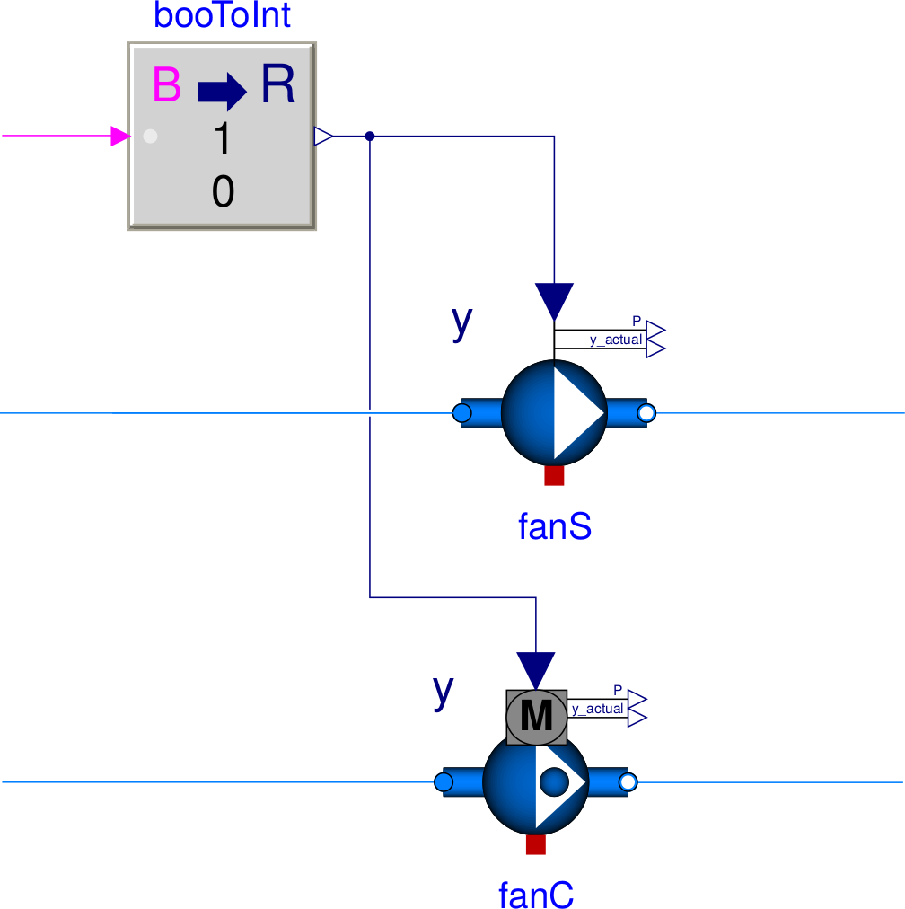

Work-Arounds
============

This section describes work-arounds that often help if there are problems during the model translation, initialization or simulation.

Avoiding step changes
---------------------

All flow machines (fans and pumps) have a boolean parameter
``filteredSpeed``, and all actuators have a boolean parameter
``filteredOpening``.
If set to ``true``, which is the default setting, then the control input signal is sent to
a :term:`2nd order low pass filter` that changes a step signal to a smooth signal.
This typically improves the robustness of the simulation.

To see the effect of the filter, consider the model below
in which ``fanS`` is configured with
``filteredSpeed=false``, and ``fanC`` is configured with
``filteredSpeed=true``.
Both fans are connected to a step input signal.
The configuration of ``fanS`` causes the fan speed to instantly change from 0 to 1. In large system models, this can lead to high computing time or to convergence problems. The ``fanC`` avoids this problem because the speed of the fan varies continuously, thereby making it easier for the solver to compute a solution. In this model, we set the parameter
``raiseTime=30`` seconds.

.. _FigureFilteredResponse:

   Schematic diagram of fans that are configured with ``filteredSpeed=false`` (``fanS``) and ``filteredSpeed=true`` (``fanC``).

.. figure:: img/fanStepResponse.png

   Mass flow rate of the two fans for a step input signal at 0 seconds.

For fans and pumps, the dynamics introduced by the filter can be thought of as approximating
the rotational inertia of the fan rotor and the inertia of the fluid in the duct or piping network.
The default value is ``raiseTime=30`` seconds.

For actuators, the raise time approximates the travel time of the valve lift.
The default value is ``raiseTime=120`` seconds.

.. note:: When changing ``filteredSpeed`` (or ``filteredOpening``),
          or when changing the value of ``raiseTime``, the dynamic
          response of the closed loop control changes. Therefore,
          control gains may need to be retuned to ensure satisfactory
          closed loop control performance.

For further information, see the
`User's Guide of the flow machine package <http://simulationresearch.lbl.gov/modelica/releases/latest/help/Buildings_Fluid_Movers_UsersGuide.html>`_, and the
`User's Guide of the actuator package <http://simulationresearch.lbl.gov/modelica/releases/latest/help/Buildings_Fluid_Actuators_UsersGuide.html>`_.

Breaking algebraic loops
------------------------

In fluid flow systems, flow junctions where mass flow rates separate and mix can couple non-linear systems of equations. This leads to larger systems of coupled equations that need to be solved, which often causes larger computing time and can sometimes cause convergence problems.
To decouple these systems of equations, in the model of a flow splitter or mixer (model `Buildings.Fluid.FixedResistances.PressureDrop <http://simulationresearch.lbl.gov/modelica/releases/latest/help/Buildings_Fluid_FixedResistances.html#Buildings.Fluid.FixedResistances.PressureDrop>`_), or in models for fans or pumps (such as the model `Buildings.Fluid.Movers.SpeedControlled_y <http://simulationresearch.lbl.gov/modelica/releases/latest/help/Buildings_Fluid_Movers.html#Buildings.Fluid.Movers.SpeedControlled_y>`_), the parameter ``dynamicBalance`` can be set to ``true``. This adds a control volume at the fluid junction that can decouple the system of equations.

Reducing nonlinear equations of serially connected flow resistances
-------------------------------------------------------------------

In fluid flow systems, if multiple components are connected in series,
then computing the pressure drop due to flow friction in the
individual components can lead to coupled nonlinear systems of equations.
While this is no problem for small models, the iterative solution can lead to higher computing time, particularly in large models where other equations may
be part of the residual function.

For illustration, consider the simple system shown below in which the flow resistances ``res1`` and ``res2`` compute the mass flow rate as
:math:`\dot m = k \, \sqrt{\Delta p}` if the parameter ``from_dp`` is set to ``true``, or otherwise compute the pressure drop between their inlet and outlet as :math:`\Delta p = (\dot m / k)^2`. (Both formulations are implemented using :term:`regularization` near zero.)

   Schematic diagram of two flow resistances in series that connect a source and a volume.

Depending on the configuration of the individual component models, simulating this system model may require the iterative solution of a nonlinear equation to compute the mass flow rate or the pressure drop.
To avoid a nonlinear equation, use any of the measures below.

 - Set the parameter ``res2(dp_nominal=0)``, and add the pressure drop to the parameter ``dp_nominal`` of the model ``res1``. This will eliminate the equation that computes the flow friction in ``res2``, thereby avoiding a nonlinear equation. The same applies if there are multiple components in series, such as a pre-heat coil, a heating coil and a cooling coil.
 - Set ``from_dp=false`` in all components, which is the default setting. This will cause Modelica to use a function that computes the pressure drop as a function of the mass flow rate. Therefore, a code translator is likely to generate an equation that solves for the mass flow rate, and it then uses the mass flow rate to compute the pressure drop of the components that are connected in series.

Control valves also allow lumping the pressure drop into the model of the valve. Consider the situation where a fixed flow resistance is in series with a control valve as shown below.

   Schematic diagram of a fixed flow resistance and a valve in series  that connect a source and a volume.

Suppose the parameters are

.. code-block:: modelica

   Buildings.Fluid.FixedResistances.PressureDrop res(
     redeclare package Medium = Medium,
     m_flow_nominal=0.2,
     dp_nominal=10000);

   Buildings.Fluid.Actuators.Valves.TwoWayLinear val(
     redeclare package Medium = Medium,
     m_flow_nominal=0.2,
     dpValve_nominal=5000);

To avoid a nonlinear equation, the flow resistance could be deleted as shown below.

   Schematic diagram of a valve that connects a source and a volume.

If the valve is configured as

.. code-block:: modelica

   Buildings.Fluid.Actuators.Valves.TwoWayLinear val(
     redeclare package Medium = Medium,
     m_flow_nominal=0.2,
     dpValve_nominal=5000,
     dpFixed_nominal=10000);

then the valve will compute the composite flow coefficient
:math:`\bar k` as

.. math::

    \bar k = \frac{1}{\sqrt{1/k_v(y) + 1/k_f}}

where :math:`k_v(y) = \dot m(y)/\sqrt{\Delta p}` is the flow coefficient of the valve at the lift :math:`y`, and
:math:`k_f` is equal to the ratio ``m_flow_nominal/sqrt(dpFixed_nominal)``.
The valve model then computes the pressure drop using :math:`\bar k` and the same equations as described above for the fixed resistances.
Thus, the composite model has the same :term:`valve authority` and mass flow rate, but a nonlinear equation can be avoided.

For more details, see the
`User's Guide of the actuator package <http://simulationresearch.lbl.gov/modelica/releases/latest/help/Buildings_Fluid_Actuators_UsersGuide.html>`_.

Prescribed mass flow rate
-------------------------
For some system models, the mass flow rate can be prescribed by using an idealized pump or fan (model `Buildings.Fluid.Movers.FlowControlled_m_flow <http://simulationresearch.lbl.gov/modelica/releases/latest/help/Buildings_Fluid_Movers.html#Buildings.Fluid.Movers.FlowControlled_m_flow>`_) or a source element that outputs the required mass flow rate (such as the model `Buildings.Fluid.Sources.MassFlowSource_T <http://simulationresearch.lbl.gov/modelica/releases/latest/help/Buildings_Fluid_Sources.html#Buildings.Fluid.Sources.MassFlowSource_T>`_). Using these models avoids having to compute the intersection of the fan curve and the flow resistance. In some situations, this can lead to faster and more robust simulation.

Avoiding overspecified initialization problems
----------------------------------------------

If in thermofluid flow systems, Dymola fails to translate a model with the error message::

   Error: The initialization problem is overspecified for variables
   of element type Real
   The initial equation
   ...
   refers to variables, which are all knowns.
   To correct it you can remove this equation.

then the initialization problem is overspecified. To avoid this, set

.. code-block:: modelica

   energyDynamics = Modelica.Fluid.Types.Dynamics.DynamicsFreeInitial;
   massDynamics = Modelica.Fluid.Types.Dynamics.DynamicsFreeInitial;

in the instances of the components that contain fluid volumes.
See also the section :ref:`ReferencePressureIncompressibleFluids`.
