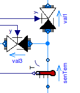
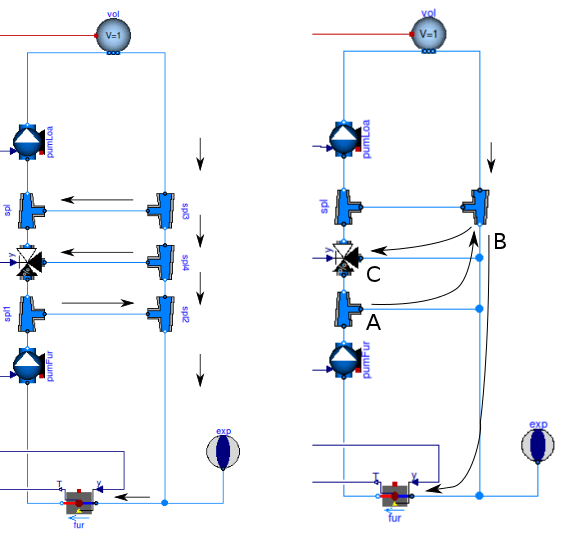
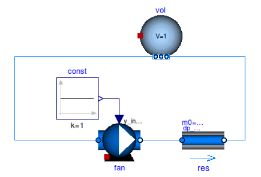
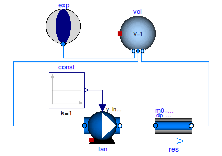
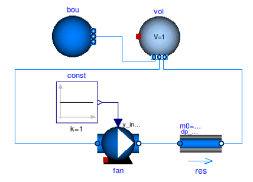

Best Practice
=============

This section explains to library users the best practice in creating new system models. The selected topics are based on problems that we often observed with new users. Experienced users of Modelica may skip this section.

Organization of packages
------------------------

When developing models, one should distinguish between a library which contains widely applicable models, such as the `Buildings` library, and an application-specific model which may be created for a specific building and is of limited use to others. 
We recommend to store application-specific models outside of the `Buildings` library. This will allow replacing the `Buildings` library with a new version without having to change the application-specific model.
If during the course of the development of application-specific models, some models turn out to be of interest for other applications, then they can be contributed to the development of the `Buildings` library, as described in the section :ref:`Development`.

Building large sytem models
---------------------------

When creating a large system model, it is typically easiest to build the system model through the composition of subsystem models that can be tested in isolation. For example, the package ``Buildings.Examples.ChillerPlant.BaseClasses.Controls.Examples``
contains small test models that were used to test individual components for use in the large system model ``Buildings.Examples.ChillerPlant``.
Creating small test models typically saves time as the proper response of controls, and the proper operation of subsystems, can be tested isolation of complex system-interactions that are often present in large models.
In addition to these small test, it it also recommended to use propagation of parameters and media packages as described in the next section.

Propagating parameters and media packages
--------------------------------------------
To manage the complexity of large system models, Modelica allows to
encapsulate individual classes. Consider a model with a pump ``pum`` and a mass flow sensor ``sen``. These models may be encapsulated in a new model called ``myPum``. Parameters of ``pum`` and ``sen``, such as the nominal mass flow rate ``m_flow_nominal``, may still be assigned from the top-level using the syntax

.. code-block:: modelica
   
   myPum(pum(m_flow=0.1));
   myPum(sen(m_flow=0.1));

However, this is tedious, in particular if submodels share parameters that need to be set to the same value. In this situation, it is recommended that common parameters are propagated to the top-level.

Propagating parameters and packages is particularly important for medium definitions, as this allows to change the medium declaration at one location and the propagated to all models that use the medium. This can be done by using the declaration

.. code-block:: modelica

   replaceable package Medium = Modelica.Media.Interfaces.PartialMedium
     "Medium model for air" annotation (choicesAllMatching=true);

Thermofluid systems
-------------------

Overdetermined initialization problem and inconsistent equations
~~~~~~~~~~~~~~~~~~~~~~~~~~~~~~~~~~~~~~~~~~~~~~~~~~~~~~~~~~~~~~~~

Consider a model consisting of a mass flow source ``Modelica.Fluid.Sources.MassFlowSource_T``, a fluid volume ``Buildings.Fluid.MixingVolumes.MixingVolume`` and
a fixed boundary condition ``Buildings.Fluid.Sources.FixedBoundary``, connected in series as shown in the figure below.

.. figure:: img/MixingVolumeInitialization.png
   
   Schematic diagram of a flow source, a fluid volume, and a pressure source.

The volume allows to configure balance equations for energy and mass in four different ways. 
Let :math:`p(\cdot)` be the pressure of the volume,
:math:`p_0` the parameter for the initial pressure,
:math:`m(\cdot)` be the mass of the volume, and
:math:`\dot m(\cdot)` be the mass flow rate across the fluid ports of the volume.
Then, the equations for the mass balance can be configured as

+--------------------------+--------------------------------+--------------------------------+---------------------------------------+  
| Parameter                | Initialization problem         | Initialization problem         | Equation used during time stepping    |
+--------------------------+--------------------------------+--------------------------------+---------------------------------------+  
|                          | If :math:`\rho = \rho(p)`      | If :math:`\rho \not = \rho(p)` |                                       |
+==========================+================================+================================+=======================================+
|``DynamicsFreeInitial``   | Unspecified                    | Unspecified                    | :math:`dm(t)/dt = \sum \dot m(t)`     |
+--------------------------+--------------------------------+--------------------------------+---------------------------------------+  
|``FixedInitial``          | :math:`p(0)=p_0`               | Unspecified                    | :math:`dm(t)/dt = \sum \dot m(t)`     |  
+--------------------------+--------------------------------+--------------------------------+---------------------------------------+  
|``SteadyStateInitial``    | :math:`dp(0)/dt = 0`           | Unspecified                    | :math:`dm(t)/dt = \sum \dot m(t)`     |  
+--------------------------+--------------------------------+--------------------------------+---------------------------------------+  
|``SteadyState``           | Unspecified                    | Unspecified                    | :math:`0 =  \sum \dot m(t)`           | 
+--------------------------+--------------------------------+--------------------------------+---------------------------------------+  

*Unspecified* means that no equation is declared for 
:math:`p(0)`. In this situation, there can be two cases:

1. If a system model sets the pressure, such as in the model above in which
   ``vol.p=bou.p`` due to the connection between the models, then
   :math:`p(0)` of the volume is equal to ``bou.p``.
2. If a system model does not set the pressure, then the pressure starts 
   at the value ``p(start=Medium.p_default)``, where ``Medium`` is the 
   medium model

Since the model ``Buildings.Fluid.Sources.FixedBoundary`` fixes the pressure at its port, it follows that the initial conditions :math:`p(0)=p_0` and :math:`dp(0)/dt = 0` lead to an overspecified system for the model shown above. To avoid such a situation, use different initial conditions, or add a flow resistance between the mixing volume and the pressure source. The flow resistance will introduce an equation that relates the pressure of the mixing volume and the pressure source as a function of the mass flow rate, thereby removing the inconsistency.

.. warning::

   The setting ``FixedInitial`` should be used with caution: Since the pressure dynamics is fast, this setting
   can lead to very fast transients when the simulation starts. Such transients can cause numerical problems
   for differential equation solvers.

Similarly, for the energy balance, 
let :math:`U(\cdot)` be the energy stored in the volume,
:math:`T(\cdot)` be the temperature of the volume,
:math:`m(\cdot)` be the mass flow rate across the fluid connectors of the volume
that carries the specific enthalpy per unit mass
:math:`h(\cdot)`, and let
:math:`Q(\cdot)` be the heat flow across the heat port of the volume.
Then, the energy balance can be configured as

+------------------------+-----------------------------------------+--------------------------------------------------------------+
| Parameter              | Initialization problem                  | Equation used during time stepping                           | 
+========================+=========================================+==============================================================+
|``DynamicsFreeInitial`` |  Unspecified                            | :math:`dU(t)/dt = \sum \dot m(t) \, h(t) + \sum \dot Q(t)`   | 
+------------------------+-----------------------------------------+--------------------------------------------------------------+
|``FixedInitial``        |  :math:`T(0)=T_0`                       | :math:`dU(t)/dt = \sum \dot m(t) \, h(t) + \sum \dot Q(t)`   | 
+------------------------+-----------------------------------------+--------------------------------------------------------------+
|``SteadyStateInitial``  |  :math:`dT(0)/dt = 0`                   | :math:`dU(t)/dt = \sum \dot m(t) \, h(t) + \sum \dot Q(t)`   | 
+------------------------+-----------------------------------------+--------------------------------------------------------------+
|``SteadyState``         |  Unspecified                            | :math:`0 =  \sum \dot m(t) \, h(t) + \sum \dot Q(t)`         |
+------------------------+-----------------------------------------+--------------------------------------------------------------+

*Unspecified* means that no equation is declared for 
:math:`T(0)`. In this situation, there can be two cases:

1. If a system model sets the temperature, such as if in the model
   the heat port of ``vol`` would be connected to a fixed temperature,
   then
   :math:`T(0)` of the volume would be equal to the temperature connected
   to this port.
2. If a system model does not set the temperature, then the temperature starts 
   at the value ``T(start=Medium.T_default)``, where ``Medium`` is the 
   medium model

.. note::

   1. Selecting ``SteadyState`` for the energy balance and 
      *not* ``SteadyState`` for the mass balance
      can lead to inconsistent equations. The model will check for this situation 
      and stop the translation with an error message.
      To see why the equations are inconsistent, 
      consider a volume with two fluid ports 
      and no heat port. Then, it is is possible 
      that :math:`\dot m_1(t) \not = 0` and :math:`\dot m_2(t) = 0`, 
      since :math:`dm(t)/dt =  \dot m_1(t) + \dot m_2(t)`. 
      However, since the energy balance equation 
      is :math:`0 = \sum \dot m(t) \, h(t) + \sum \dot Q(t)`, 
      we have :math:`0 = \dot m_1(t) \, h_1(t)` and hence the 
      equation is inconsistent.
   2. Unlike the case with the pressure initialization, the temperature in
      the model ``bou`` does not lead to ``vol.T = bou.T`` at initial time,
      because physics allows the temperatures in ``bou`` and ``vol`` to 
      be different.

The equations for the mass fraction dynamics, such as the 
water vapor concentration, 
and the trace substance dynamics, such as carbon dioxide concentration,
are similar to the energy equations.

Let 
:math:`X(\cdot)` be the mass of the species in the volume,
:math:`m(0)` be the initial mass of the volume,
:math:`x_0` be the user-selected species concentration in the volume,
:math:`x(\cdot)` be the species concentration at the fluid port, and
:math:`\dot X(\cdot)` be the species added from the outside, for example the water vapor added by a humidifier.
Then, the substance dynamics can be configured as

+------------------------+-----------------------------------------+--------------------------------------------------------------+
| Parameter              | Initialization problem                  | Equation used during time stepping                           | 
+========================+=========================================+==============================================================+
|``DynamicsFreeInitial`` |  Unspecified                            | :math:`dX(t)/dt = \sum \dot m(t) \, x(t) + \sum \dot X(t)`   | 
+------------------------+-----------------------------------------+--------------------------------------------------------------+
|``FixedInitial``        |  :math:`X(0)=m(0) \, x_0`               | :math:`dX(t)/dt = \sum \dot m(t) \, x(t) + \sum \dot X(t)`   | 
+------------------------+-----------------------------------------+--------------------------------------------------------------+
|``SteadyStateInitial``  |  :math:`dX(0)/dt = 0`                   | :math:`dX(t)/dt = \sum \dot m(t) \, x(t) + \sum \dot X(t)`   | 
+------------------------+-----------------------------------------+--------------------------------------------------------------+
|``SteadyState``         |  Unspecified                            | :math:`0 = \sum \dot m(t) \, x(t) + \sum \dot X(t)`          | 
+------------------------+-----------------------------------------+--------------------------------------------------------------+

The equations for the trace dynamics, such as the carbon dioxide concentration, are identical to the equations for the substance dynamics, if
:math:`X(\cdot), \, \dot X(\cdot)` and :math:`x(\cdot)` are replaced with
:math:`C(\cdot), \, \dot C(\cdot)` and :math:`c(\cdot)`, where
:math:`C(\cdot)` is the mass of the trace substances in the volume,
:math:`c(\cdot)` is the trace substance concentration at the fluid port and
:math:`\dot C(\cdot)` is the trace substance flow rate added from the outside.
Therefore, energy, mass fraction and trace substances have identical equations and configurations.

Modeling of fluid junctions
~~~~~~~~~~~~~~~~~~~~~~~~~~~
In Modelica, connecting fluid ports as shown below leads to ideal mixing at the junction.
In some situation, such as the configuration below, connecting multiple connectors to a fluid port may be fine.

   
   Connection of three components without explicitly introducing a mixer or splitter model.

However, in more complex flow configurations, one may want to explicitly control what branches of a piping or duct network mix. This may be achieved by using an instance of the model
`SplitterFixedResistanceDpM <http://simulationresearch.lbl.gov/modelica/releases/latest/help/Buildings_Fluid_FixedResistances.html#Buildings.Fluid.FixedResistances.SplitterFixedResistanceDpM>`_ as shown in the example below, which is the test model 
`BoilerPolynomialClosedLoop <http://simulationresearch.lbl.gov/modelica/releases/latest/help/Buildings_Fluid_Boilers_Examples.html#Buildings.Fluid.Boilers.Examples.BoilerPolynomialClosedLoop>`_

   
   Connection of components with use of a mixer or splitter model.

In this model, the mixing point has been defined by use of the three-way model that mixes or splits flow. By setting the nominal pressure drop of the mixer or splitter model to zero, the mixer or splitter model can be simplified so that no equation for the flow resistance is introduced.

Use of sensors in fluid flow systems
~~~~~~~~~~~~~~~~~~~~~~~~~~~~~~~~~~~~
When selecting a sensor model, a distinction needs to be made whether the measured quantity depends on the direction of the flow or not. If the quantity depends on the flow direction, such as temperature or relative humidity, then sensors with two ports that model a dynamic response of the sensor should be used, as sensors with one port exhibit a step change when the flow reverses its direction.
The proper use sensors is described in the 
`User's Guide <http://simulationresearch.lbl.gov/modelica/releases/latest/help/Buildings_Fluid_Sensors_UsersGuide.html>`_ of the ``Buildings.Fluid.Sensors`` package.

Thermal expansion of water
~~~~~~~~~~~~~~~~~~~~~~~~~~

This section explains how to account for the thermal expansion of water.
Consider the flow circuit shown below that consists of a pump or fan, a flow resistance and a volume.

   
   Schematic diagram of a flow circuit without means 
   to account for the thermal expansion.

When this model is used with a medium model that models
:term:`compressible flow`, such as 
the medium model ``Buildings.Media.IdealGases.SimpleAir``,
then the model is well defined because the gas medium implements the
equation :math:`p=\rho \, R \, T`,
where :math:`p` is the static pressure, :math:`\rho` is the mass density,
:math:`R` is the gas constant and :math:`T` is the temperature.

However, when the medium model is changed to a model that models
:term:`incompressible flow`, such as
``Buildings.Media.GasesConstantDensity.SimpleAir`` or
``Buildings.Media.ConstantPropertyLiquidWater``,
then the density is constant. Consequently, there is no equation that 
can be used to compute the pressure based on the volume. 
In this situation, trying to translate the model leads in Dymola to the error message:

.. code-block:: none

   The DAE has 151 scalar unknowns and 151 scalar equations.
   Error: The model FlowCircuit is structurally singular.
   The problem is structurally singular for the element type Real.
   The number of scalar Real unknown elements are 58.
   The number of scalar Real equation elements are 58.

Similarly, if the medium model ``Modelica.Media.Water.WaterIF97OnePhase_ph``, 
which models density as a function of pressure and enthalpy, then 
the model is well-defined, but the pressure increases the longer the pump runs.
The reason is that the pump adds heat to the water. When the water temperature 
increases from :math:`20^\circ` C to :math:`40^\circ` C,
the pressure increases from 1 bar to 150 bars.

To avoid this increase singularity or in pressure, 
add a model that imposes a pressure source. For example, you may use
``Buildings.Fluid.Storage.ExpansionVessel`` 
to form the system model shown below.

   
   Schematic diagram of a flow circuit with expansion vessel
   to add a pressure source and to account for any thermal expansion
   of the medium.

Alternatively, you may use
``Buildings.Fluid.Sources.FixedBoundary`` which sets the pressure to a constant
and adds or removes fluid as needed to maintain the pressure.

   
   Schematic diagram of a flow circuit with a boundary model to add
   a fixed pressure source and to account for any thermal expansion 
   of the medium.

Start values of iteration variables
~~~~~~~~~~~~~~~~~~~~~~~~~~~~~~~~~~~
When computing numerical solutions to systems of nonlinear equations, a Newton-based solver is typically used. Such solvers have a higher success of convergence if good start values are provided for the iteration variables. In Dymola, to see what start values are used, one can enter on the simulation tab the command

.. code-block:: none
   
   Advanced.LogStartValuesForIterationVariables = true;

Then, when a model is translated, for example using

.. code-block:: none

   translateModel("Buildings.Fluid.Boilers.Examples.BoilerPolynomialClosedLoop");

an output of the form 

.. code-block:: none

   Start values for iteration variables:
    val.res1.dp(start = 3000.0)
    val.res3.dp(start = 3000.0)

is produced. This shows the iteration variables and their start values. These start values can be overwritten in the model.

Avoiding events
~~~~~~~~~~~~~~~

In Modelica, the integration is halted whenever a Real elementary
operation such as :math:`x>y` changes its value. In this situation,
an event occurs and a small interval in time is determined in which
the relation changes its value. Determining this time interval
often requires an iterative solution, which can significantly 
increase the computing time if the iteration require
the evaluation of a large system of equations. 
An example where such an event occurs is the relation

.. code-block:: modelica

		if m_flow > 0 then
		  T_in = port_a.T;
		else
		  T_in = port_b.T;
		end if;

or, equivalently,

.. code-block:: modelica

		T_in = if m_flow > 0 then port_a.T else port_b.T;

When simulating a model that contains such code, a time integrator 
will iterate to find the time instant where ``m_flow`` crosses zero.
If the modeling assumptions allow approximating this equation in
a neighborhood around ``m_flow=0``, then replacing this equation
with an approximation that does not require an event iteration can 
reduce computing time. For example, the above equation could be 
approximated as

.. code-block:: modelica

		T = Modelica.Fluid.Utilities.regStep(
		  m_flow, T_a_inflow, T_b_inflow, 
		  m_flow_nominal*1E-4);
		

where ``m_flow_nominal`` is a parameter that is set to a value that
is close to the flow rate that the model has at full load.
If the magnitude of the flow rate is larger than 1E-4 times the 
typical flow rate, the approximate equation is the same as the exact equation,
and below that value, it is an approximation. However, for such small
flow rates, not much energy is transported and hence the error is generally
negligible.

In some cases, adding dynamics to the model can further improve
the computing time, because the return value of the function
`regStep() <http://simulationresearch.lbl.gov/modelica/releases/msl/3.2/help/Modelica_Fluid_Utilities.html#Modelica.Fluid.Utilities.regStep>`_
above can change abruptly if its argument ``m_flow`` oscillates around zero,
for example due to :term:`numerical noise`.
Adding dynamics may be achieved using a formulation such as

.. code-block:: modelica
		
		TMed = Modelica.Fluid.Utilities.regStep(
		  m_flow, T_a_inflow, T_b_inflow, 
		  m_flow_nominal*1E-4);
		der(T)=(TMed-T)/tau;

where ``tau``>0 is a time constant. See for example
`Buildings.Fluid.Sensors.TemperatureTwoPort <http://simulationresearch.lbl.gov/modelica/releases/latest/help/Buildings_Fluid_Sensors.html#Buildings.Fluid.Sensors.TemperatureTwoPort>`_
for a robust implementation.

.. note::
   In the package `Buildings.Utilities.Math <http://http://simulationresearch.lbl.gov/modelica/releases/latest/help/Buildings_Utilities_Math.html#Buildings.Utilities.Math>`_ the functions and blocks whose name starts with ``smooth`` can be used to avoid events.

Numerical solvers
-----------------
Dymola 2012 FD01 is configured to use dassl as a default solver with a tolerance of 
1E-4.
We recommend to change this setting to radau with a tolerance of
1E-6 as this generally leads to faster and more robust
simulation for thermofluid systems.

