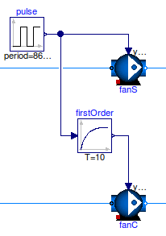

Work-Arounds
============

This section describes work-arounds that often help if there are problems during the model translation, initialization or simulation.

Avoiding step changes
---------------------

Consider the model below in which ``fanS`` is directly connected to a block that outputs 0 or 1, and ``fanC`` is connected to a first order block that computes its output signal :math:`y(t)` as :math:`T \, dy(t)/dt = u(t)-y(t)` where :math:`T` is a time constant and :math:`u(t)` is its input signal.
The speed of both fans is equal to their input signal.
The configuration of ``fanS`` causes the fan speed to instantly change between 0 and 1. In large system models, this can lead to high computing time or to convergence problems. The implementation with ``fanC`` avoids this problem because the speed of the fan :math:`u(t)` varies continuously, thereby making it easier for the solver to compute a solution. In this model, we set the time response of the first order block to 10 seconds, as this may approximate the time response of the fan rotor.

In large system models, adding such a first order response often avoids numerical problems that can occur when control signals or control setpoints switch.

   
   Schematic diagram of fans that are connected to a block that outputs a step, and connected to a first order response.

Breaking algebraic loops
------------------------
In fluid flow systems, flow junctions where mass flow rates separate and mix can couple non-linear systems of equations. This leads to larger systems of coupled equations that need to be solved, which often causes larger computing time and can sometimes cause convergence problems.
To decouple these systems of equations, the model of a flow splitter or mixer (model `Buildings.Fluid.FixedResistances.SplitterFixedResistanceDpM <http://simulationresearch.lbl.gov/modelica/releases/latest/help/Buildings_Fluid_FixedResistances.html#Buildings.Fluid.FixedResistances.SplitterFixedResistanceDpM>`_), or in models for fans or pumps (such as the model `Buildings.Fluid.Movers.FlowMachine_y <http://simulationresearch.lbl.gov/modelica/releases/latest/help/Buildings_Fluid_Movers.html#Buildings.Fluid.Movers.FlowMachine_y>`_), the parameter ``dynamicBalance`` can be set to ``true``. This adds a control volume that often decouples the system of equations.

Prescribed mass flow rate
-------------------------
For some system models, the mass flow rate can be prescribed by using an idealized pump or fan (model `Buildings.Fluid.Movers.FlowMachine_m_flow <http://simulationresearch.lbl.gov/modelica/releases/latest/help/Buildings_Fluid_Movers.html#Buildings.Fluid.Movers.FlowMachine_m_flow>`_) or a source element that outputs the required mass flow rate (such as the model `Buildings.Fluid.Sources.MassFlowSource_T <http://simulationresearch.lbl.gov/modelica/releases/latest/help/Buildings_Fluid_Sources.html#Buildings.Fluid.Sources.MassFlowSource_T>`_). Using these models avoids having to compute the intersection of the fan curve and the flow resistance. In some situations, this can lead to faster and more robust simulation.

Avoiding overspecified initialization problems
----------------------------------------------

If in thermofluid flow systems, Dymola fails to translate a model with the error message::

   Error: The initialization problem is overspecified for variables 
   of element type Real
   The initial equation
   ...
   refers to variables, which are all knowns.
   To correct it you can remove this equation.

then the initialization problem is overspecified. To avoid this, set

.. code-block:: modelica

   energyDynamics = Modelica.Fluid.Types.Dynamics.DynamicsFreeInitial;
   massDynamics = Modelica.Fluid.Types.Dynamics.DynamicsFreeInitial;

in the instances of the components that contain fluid volumes.
See also the section :ref:`ThermalExpansionOfWater`.
